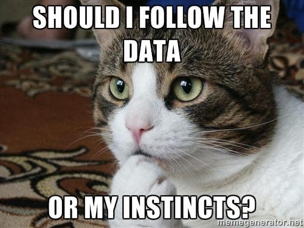

# Journal — 09132025 — Building Data Pipeline

## 1) What I learned (bullets, not prose)
- DE skills: problem-solving, precision, learning, collaboration, efficiency
- ETL vs ELT (Extract-Transform-Load vs Extract-Load-Transform)
- OLAP vs OLTP differences (analytics vs transactions)
- Column DB vs Row DB trade-offs
- SQL commands (DDL, DML, TCL, DQL, DCL)
- Big Data “6 Vs” (volume, variety, velocity, veracity, variability, value)
- Data quality dimensions (completeness, accuracy, consistency, validity, uniqueness, integrity)
- Special values in SQL (NULL, NaN, Infinity, empty string, sentinel values)
- 3-stage pipeline: Bronze (raw) → Silver (clean) → Gold (mart)
- DBeaver Sandbox layer for experiments
- Intro to dbt & Metabase

## 2) New vocabulary (define in your own words)
- **term** — my definition
- **OLAP** — analytical DB, optimized for reads & aggregations
- **OLTP** — transactional DB, optimized for inserts/updates
- **ETL** — Extract → Transform → Load
- **ELT** — Extract → Load → Transform
- **Sentinel values** — placeholders for missing/special cases
- **Bronze/Silver/Gold** — pipeline layers from raw to business-ready data
- **DBeaver** — app to manages database with a GUI 
- **Docker** — tool to run apps in portable container
- **Sandbox** — isolated testing space for queries/models
- **Metabase** — BI tool for dashboards & visualization

## 3) Data Engineering mindset applied (what principles did I use?)
- Keep raw data intact for lineage
- Clean & standardize in stages
- Use layered pipelines (bronze/silver/gold)
- Focus on data quality dimensions
- Balance trade-offs between ETL vs ELT, OLTP vs OLAP
- Continuous learning of tools (dbt, docker, dbeaver, ClickHouse, Metabase)

## 4) Decisions & assumptions (why, alternatives, trade-offs)
- Used Sandbox -- safe testing, but must clean up clutter
- Preferred NULL over sentinel values-- clearer handling of missingness

## 5) Open questions (things I still don’t get)
- When is normalization vs denormalization best?
- Streaming data practices in ClickHouse?

## 6) Next actions (small, doable steps)
- [ ] study git
- [ ] study dbt specifically dbt model and documentation
- [ ] practice SQL
- [ ] study linux commands/bash/shell, docker
- [ ] explore dbeaver and metabase

## 7) Artifacts & links (code, queries, dashboards)
--- missing values
-- messy text: inconsis
SELECT horsepower
FROM raw.autompg___cars
WHERE horsepower = 'nan' OR horsepower IS NULL;

CREATE TABLE sandbox.mpg_vs_hp ENGINE = Memory AS
SELECT mpg, horsepower
FROM clean.mpg_standardized;

---

### Mini reflection (3–5 sentences)
I learned the importance of cleaning and structuring data. The bronze/silver/gold model is useful but can add complexity. Sentinel values might look fine at first but cause problems later. Next time, I’ll be more careful about cleaning rules, transformations, and metadata.

### BONUS: What is a meme that best describes what you feel or your learning today?

