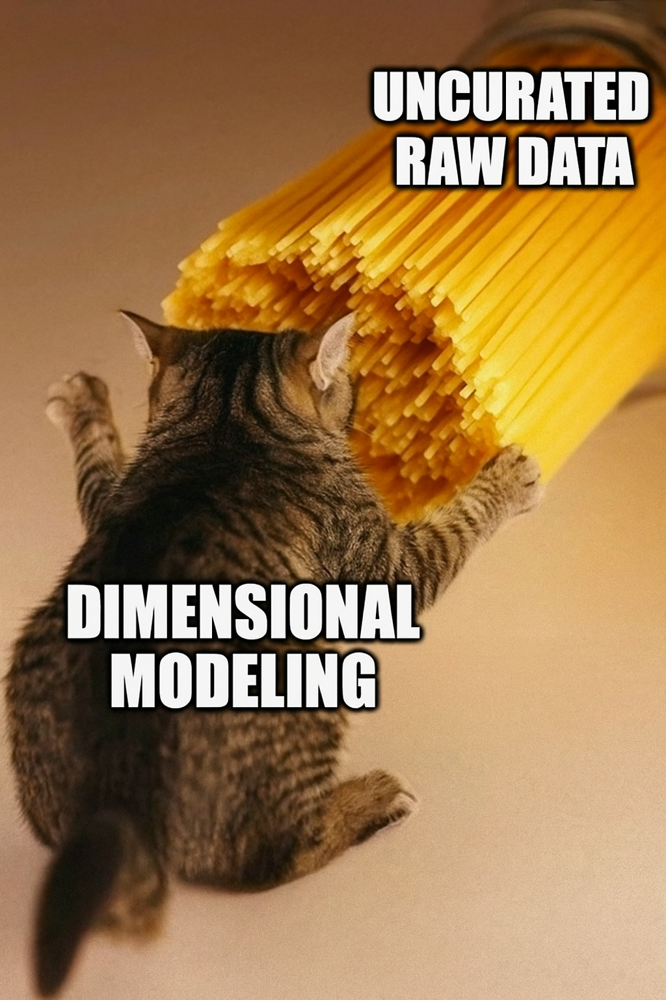

# Journal — 2025-09-27 — DAY 3: Dimensional Exercises, Data Engineering Documentation, Presentation of Data Pipeline

## 1) What I learned (bullets, not prose)

- Data modeling and testing
  - Compare row counts between raw, clean, and original datasets.
  - Use aggregation checks (e.g., sum of sales) as a smell test.
  - Normalize data to catch inconsistencies.
  - Best practice: check counts, sums, and outliers at each stage for consistency.

- ETL/ELT
  - Purpose: move data from one place to another and deliver clean, usable data.
  - Staging flow:
    - Bronze/raw → ingestion (via dlt).
    - Silver/clean → transformations with dbt (casting, renaming, null handling).
    - Gold/mart → fact & dimension tables.

- Dimensional modeling
  - Start schema design: join fact to dimension tables.
  - Snowflake schema: dimension-to-dimension joins (avoid this!)

- Communication
  - Show clear improvements from Chinook raw data to dimensional model.
  - Visualize results in Metabase for dashboards and business insights.
  - Dashboards help analysts answer questions more easily.

- Documentation & teamwork
  - Documented the modeling journey: raw → clean → mart → BI.
  - Collaboration is important
  - Best practices: consistent naming, group debugging, simple joins in schema.

## 2) New vocabulary (define in your own words)
- **Star schema** — fact table connects directly to dimension tables.
- **Snowflake schema** — dimension tables are normalized and may connect to other dimension tables.
- **Smell test** — A quick check (like sums or counts) to see if numbers “look right.”

## 3) Data Engineering mindset applied (what principles did I use?)
- Validate at every stage — counts, sums, and anomalies should be checked.
- Keep models simple for downstream analysts (easy-to-query star schema).

## 4) Decisions & assumptions (why, alternatives, trade-offs)
- One consolidated model vs. individual models
  - Decision: consolidated into one schema for the team.
  - Trade-off: less individual flexibility but better for consistency and real-world use.

- Schema design
  - Chose star schema for simplicity and ease of BI queries.
  - Snowflake schema was avoided.

## 5) Open questions (things I still don’t get)
- When should I choose a star schema vs. snowflake schema in dimensional modeling?
- How do I decide the granularity of a fact table correctly?

## 6) Next actions (small, doable steps)
- [ ] Study Git basics for version control and documentation.
- [ ] Study SQL join queries (clickhouse)
- [ ] Practice identifying fact and dim tables
- [ ] Make group tracker for task

## 7) Artifacts & links (code, queries, dashboards)
- Chinook analysis dashboard: https://ftw.dataengineering.ph/dashboard/11-chinook-analysis-dashboard?text=
- Team repo: https://github.com/minadg/ftw-de-group5

### Mini reflection (3–5 sentences)
I was surprised by how much value simple consistency checks (counts, sums) add to data quality. Next time, I’d start documentation earlier, since it helps me see my progress more clearly. I’ll be careful about schema naming, version control, and making joins as simple as possible.

### BONUS: What is a meme that best describes what you feel or your learning today?

