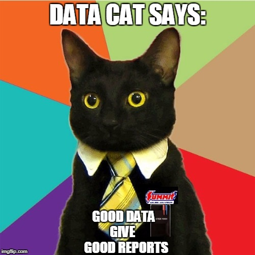

# Journal — 10-11-2025 — DAY 5 - Data Collection & Web Scraping 101

## 1) What I learned (bullets, not prose)
- Learned how data flows through its lifecycle — from **source to serving** and finally to **decision-making**.  
- Understood **different data formats** (CSV, JSON, XML, Parquet) and why we should pick formats based on use case, not convenience.  
- Discovered how **pandas** and **ibis** help with data analysis and system connections.  
- Practiced **API handling** — learning about endpoints, parameters, authentication, and rate limits.  
- Learned how **web scraping** works, including identifying static vs dynamic pages and how to handle JavaScript-rendered data.  
- Realized how important **data ethics** and **data quality checks** are — we should always collect data responsibly and maintain accuracy.  
- Understood that **data engineering isn’t just about code** — it’s also about being ethical, organized, and thoughtful in how we collect and use data.

---

## 2) New vocabulary (define in your own words)
- **venv** - isolate modules; library
- **Primitive Data Type** — Basic data types like integer, float, boolean, and string.  
- **Temporal Data** — Data with time-related values like date or timestamp.  
- **Categorical Data** — Data classified into categories like labels or enums.  
- **API (Application Programming Interface)** — A way for systems to talk to each other, usually using HTTP methods (GET, POST, etc.).  
- **Endpoint** — The specific URL where an API request is sent.   
- **Web Scraping** — Extracting information from websites using tools like BeautifulSoup or Playwright.  
- **Ibis** — A Python library that connects to multiple data systems and turns queries into DataFrames easily.  
- **Data Ethics** — Making sure that how we collect, store, and use data is transparent, fair, and responsible.  
- **Parquet/ORC** — A compressed, columnar file format efficient for large datasets.
- **BeautifulSoup** — A Python library for parsing and scraping HTML.
- **Headless browser** — A browser automation tool (like Playwright) that runs without a visible window.

---

## 3) Data Engineering mindset applied (what principles did I use?)
- **Validate everything** — Row counts, schemas, timestamps before loading data.  
- **Pick the right tool for the job** — Pandas for quick work, ibis for large systems.  
- **Think ethically** — Just because we *can* collect data doesn’t mean we *should*.  
- **Maintain data quality** — Clean, consistent, and verified data is the foundation for trust.

---

## 4) Decisions & assumptions (why, alternatives, trade-offs)
- Used **pandas** for smaller workflows because it’s simple and beginner-friendly.  
- Used **ibis** for connecting to multiple backends — scalable and easier to manage in larger systems.  
- Chose **JSON** format when working with APIs since it’s flexible and commonly used.  
- Decided to extract only small slices of data (using LIMIT or filters) to keep it manageable and efficient.  
- Assumed that **data quality checks** (like null detection, schema validation, and type consistency) are part of every collection process.

---

## 5) Open questions (things I still don’t get)
- How do we automate **data quality checks** in real-world pipelines?  
- How can I handle APIs with strict rate limits efficiently?
- How can bias in data collection be reduced technically (not just ethically)?  
- What’s the best way to log and monitor **API calls** efficiently?

---

## 6) Next actions (small, doable steps)
- [ ] Try to do the remaining activities on Sir Myk's git repo.
- [ ] Study **Git** deeper for version control.  
- [ ] Try using **ibis** with DuckDB and PostgreSQL connections.  
- [ ] Practice scraping simple static sites with **BeautifulSoup**.  
---

## 7) Artifacts & links (code, queries, dashboards)
- [Data Engineering PH](https://dataengineering.ph/)  
- [Pandas Documentation](https://pandas.pydata.org/)  
- [Ibis Project](https://ibis-project.org/)  
- [Open Meteo API](https://open-meteo.com/en/docs)  
- [Quotes API (Practice)](https://quotes.toscrape.com/api/quotes)

---

## NOTE: Data Quality Checks
To maintain accuracy and trust in collected data:
- ✅ Validate schema — check if column names and data types match expectations.  
- ✅ Check for missing or null values — avoid incomplete records.  
- ✅ Ensure unique IDs — prevent duplicates.  
- ✅ Verify data freshness — use timestamps (e.g., updated_at).  
- ✅ Compare row counts — before and after transformations.  
- ✅ Track lineage — always know where data came from.  
- ✅ Log errors and data anomalies for review.

> “Good data quality = good decisions.”

---

### Mini reflection (3–5 sentences)
Today I learned that most data comes from APIs and websites, and collecting it responsibly is essential. Web scraping was fun but challenging, especially with dynamic pages. I realized the importance of handling API rate limits, validating data quality, and being mindful of ethics. Moving forward, I’ll focus on ensuring clean, unbiased, and reliable data collection in every project.

---

### BONUS: Meme that fits my learning today

